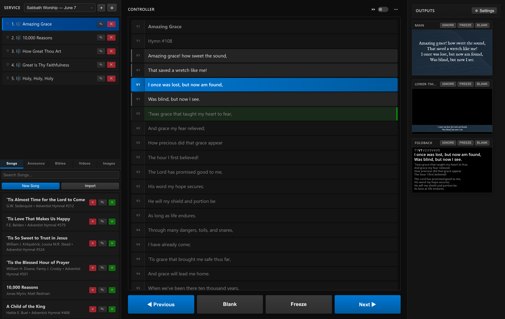
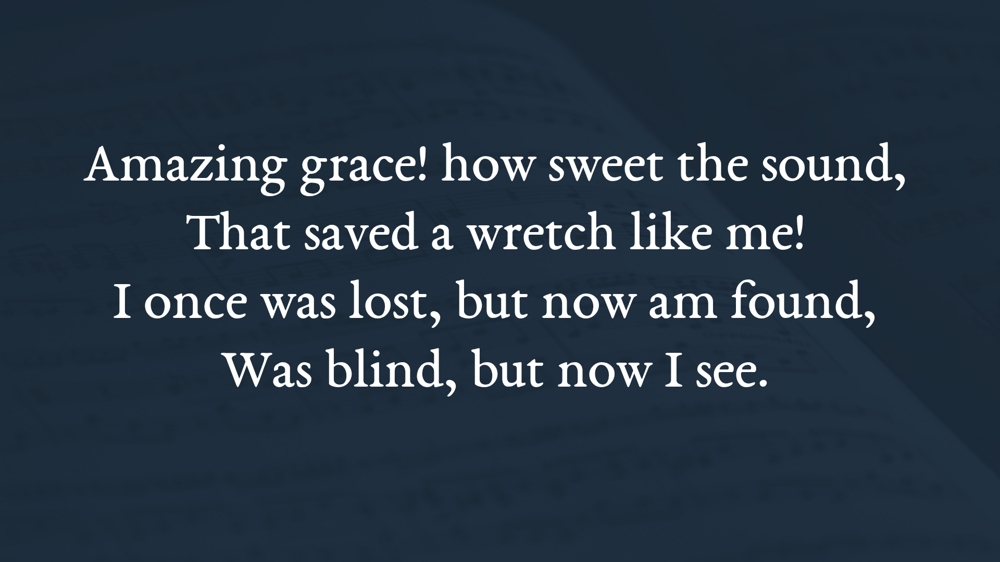
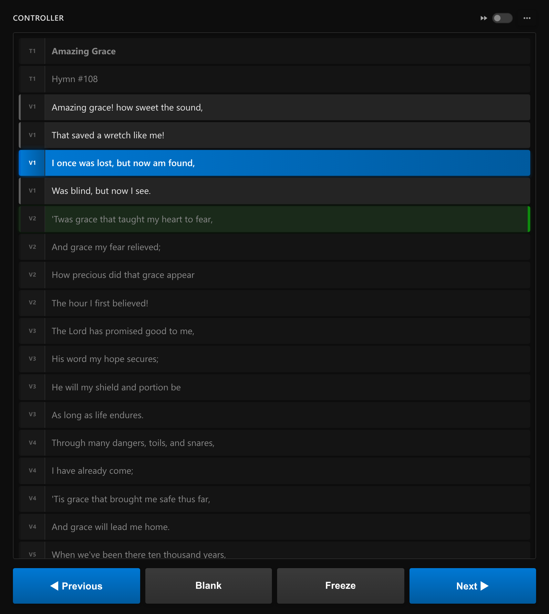
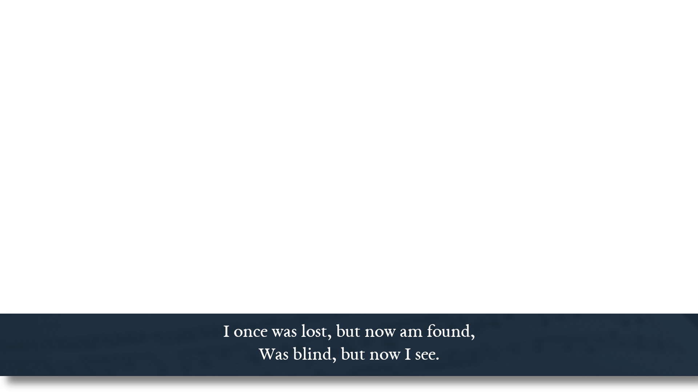
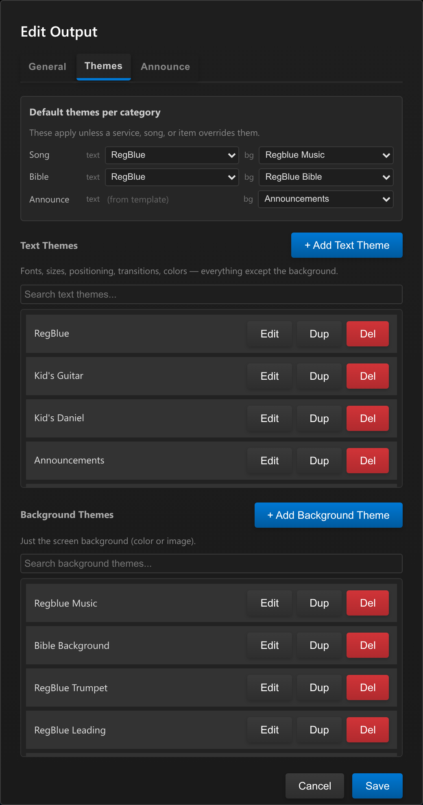

<div align="center">


# SeventhSlide

**Free worship presentation software**

Display lyrics, scripture, announcements, images and video across every screen for your services.

[](https://github.com/UmpquaRiver/SeventhSlide/actions/workflows/build-windows.yml)
[](https://github.com/UmpquaRiver/SeventhSlide/actions/workflows/build-macos.yml)
[](https://github.com/UmpquaRiver/SeventhSlide/actions/workflows/build-linux.yml)

</div>

<div align="center">
  
</div>

---

## About

A contemporary worship service requires an effective way to display lyrics, scripture, images, and videos across projectors, reinforcement displays, foldback displays, live stream graphics, and more. Finding a software to manage all these sources and destinations, while also producing a tasteful output, is difficult. Some offerings exist, but they tend to be either needlessly expensive subscriptions or are feature starved, rendering them obsolete. SeventhSlide
aims to meet all these needs for free while remaining unintimidating for the end user by relying on one
intuitive control window.

You prepare ahead of time by collecting songs, scripture references and announcements into a **service** (an ordered running list, like a printed order of worship), then click through it live during the service. Need to be spontaneous instead? Material can be loaded on the fly just as easily.

## Screenshots

| The congregation's screen | The Controller, live |
| :---: | :---: |
|  |  |
| **Lower‑thirds for the livestream** | **Per‑output themes** |
|  |  |

## Download & install

Download the latest build for your platform from the [**Releases**](https://github.com/UmpquaRiver/SeventhSlide/releases) page.

> [!NOTE]
> The macOS app and Windows installer are currently unsigned. On macOS, allow the app in **System Settings → Privacy & Security** on first launch; on Windows, click through the SmartScreen prompt.

After installing, double‑click the SeventhSlide icon to open the control window. Connect your projector or second screen as an extended desktop (not mirrored), and you can send outputs to them in the output controls.

## Documentation

**[User's Guide](manual/SeventhSlide-User-Guide.pdf)** 

## Running from source

```bash
pip install -r requirements.txt   # backend (FastAPI / uvicorn)
npm install                       # Electron shell
npm start
```

The admin window opens on `http://127.0.0.1:49777/admin`.
